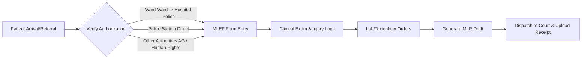
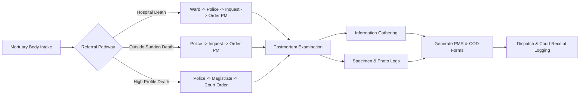

# Requirements Analysis Report: Forensic Medical Department Database System

This report presents a detailed requirement analysis for the design and development of a computerized database system for a Forensic Medical Department. It synthesizes information from:
1.  **Mini Project Assignment Guidelines** (`Mini Project Assignment.pdf`)
2.  **Requirement Gathering Meeting 1** (`requirment gathering meeting1.pdf`)
3.  **Department Presentation by Dr. Chathula Wickramasinghe (Act. Consultant JMO)** (`Digital database.pdf`)

---

## 1. Background & Problem Statement

Currently, the Forensic Medical Department operates on a manual, paper-based record-keeping system. Records are stored in physical registers and filing cabinets. This creates major operational difficulties:
*   **Search Limitations:** Retrieving historical case records, patient timelines, and clinical files is slow and labor-intensive.
*   **Confidentiality Risks:** Medico-legal documents contain highly sensitive data (assault details, autopsy photos, injury descriptions). Physical storage makes enforcing granular access control difficult.
*   **Evidence Tracking Failures:** Maintaining a strict "Chain of Custody" for physical samples (e.g., toxicology blood, histology tissue) is hard using paper logs.
*   **Reporting Overhead:** Compiling daily case reports, monthly statistics for administration, or tracking pending court submissions requires manual compilation.
*   **Report Status Monitoring:** No proactive notification when a Medico-Legal Report (MLR) or Cause of Death (COD) form remains unissued as trial dates approach.

---

## 2. User Roles & Access Control (RBAC)

The system must restrict data access based on defined roles to maintain patient confidentiality and system integrity:

| User Role | Responsibilities | Access Level |
| :--- | :--- | :--- |
| **Administrator** | Manage user accounts, verify system logs, database backup, and restore. | Full access to system configs, metadata, and user accounts. No edit rights on medical files. |
| **Clerk / Admin Staff** | Register patients, create cases, record incident details, log court report dispatches, and scan/upload court receipts. | Create/Read/Update on Patient, Case, and Dispatch logs. No access to clinical injury or autopsy findings. |
| **Doctor / JMO** | Perform examinations, record clinical MLEFs, document autopsy findings (PMR/COD), order lab tests, and generate draft reports. | Create/Read/Update on clinical, autopsy, and case records. Read-only on lab results. |
| **Laboratory Staff** | Retrieve pending test orders, enter results for toxicology/histology/DNA tests, and mark tests as completed. | Create/Read/Update on Lab Test Results and Evidence Status only. Read-only on general case data. |

---

## 3. General Department & Patient Information Requirements

### Patient Registration
The system must capture personal details for both living victims (clinical cases) and deceased individuals (autopsy cases):
*   **Full Name** (Unicode support for local names)
*   **NIC / Passport Number** (Unique identifier)
*   **Age** (Validated between 0 and 150)
*   **Gender** (Male, Female, Other)
*   **Address** (Permanent residence)
*   **Contact Details** (Phone numbers, relative contact details)
*   **Hospital Bed Head Ticket (BHT) / Admission Number** (Nullable)
*   **Patient Status** (Alive vs. Deceased)

> [!NOTE]
> **Database Relationship Rule:** The system must support a **One-to-Many relationship** between a Patient and Cases (i.e., one patient/victim can have multiple forensic cases over time).

---

## 4. Core Case & Workflow Requirements

Every case must be uniquely identified and tracked through one of two distinct pathways: **Clinical Forensic** or **Autopsy**.

### General Case Meta-Data
Every case entry must record:
*   **Case ID / Number:** Unique JMO serial format (e.g., `CW/01/24`).
*   **Police Reference Number:** Originating police station logs.
*   **Court Reference Number:** Assigned court docket identifier.
*   **Case Type:** Clinical vs. Autopsy.
*   **Critical Dates:**
    *   *Incident Date:* When the event occurred.
    *   *Admission/Arrival Date:* When the patient was admitted to the hospital or when the body was received at the mortuary.
    *   *Examination/Autopsy Date:* When the JMO conducted the exam.
    *   *Report Submission Date:* When the final report was sent to court.
*   **Relationships:**
    *   *One Case to Multiple Examinations:* A single case may require multiple follow-up JMO reviews.
    *   *Multiple Doctors to One Case:* The system must support assigning multiple JMOs to work on or review the same case.

---

### Pathway A: Clinical Forensic Component (Living Patients)

This module handles trauma, abuse, and other medico-legal examinations of living patients.

#### 1. Incoming Referrals & Authorizations
The system must track the source of clinical cases:
*   **Referral Paths:** Ward (hospital police), Police Station (direct), or External Authorities (AG Office, Human Rights Commission).
*   **Legal Authorization Documents:** Medico-Legal Examination Form (MLEF), Request Letters, or Court Orders. Scanned copies must be attachable.

#### 2. Clinical Data Entry (MLEF Structure)
The digital MLEF must capture:
*   **Consent:** Explicit flag if the examinee gave consent.
*   **Thumbprint/Signature:** Upload path for scanned consent files.
*   **Injury Cataloging:** Detail fields for location, size, and type of bodily harm.
    *   *Major Flags:* Abrasion, Contusion, Laceration, Stab, Cut, Burn, Fracture, Dislocation, Explosive, Bullet, or None.
*   **Category of Hurt:** Must categorize injuries as:
    *   Non-grievous
    *   Grievous
    *   Fatal in the ordinary course of nature
*   **Substance Check:** Flag indicating if the patient is under the influence of alcohol or other drugs (Yes/No).
*   **Police Officers details:** Name, Rank, and Badge/ID number of the officer accompanying the victim.
*   **Medical Remarks:** Detailed notes from the JMO.

#### 3. Clinical Outputs
*   Police copy of the MLEF.
*   Draft and Final Medico-Legal Report (MLR).
*   Scanned/uploaded receipt certificates from the court registrar.

---

### Pathway B: Autopsy Component (Deceased Patients)

This module handles postmortem examinations of deceased individuals to determine the cause and circumstances of death.

#### 1. Intake & Referral Pathways
*   **Hospital Deaths:** Ward notifies ward police -> Inquest conducted -> Postmortem (PM) ordered.
*   **Outside Deaths (Non-hospital):** Police notify Inquest officer -> Inquest conducted -> PM ordered.
*   **High Profile Deaths:** Police inform Magistrate -> Court Order issued -> PM conducted.
*   **Required Inputs:** Inquest/Court order scan upload.

#### 2. Information Gathering Sub-Module
A postmortem requires importing metadata from multiple sources before examination:
*   Crime scene reports and photographs.
*   Bed Head Ticket (BHT) and prior hospital history.
*   Statements from the deceased's family or eye-witnesses.
*   Statements from the investigating police officers.

#### 3. Autopsy Examination Details (PMR Structure)
*   **Autopsy Location & Facility:** Mortuary details.
*   **Cause of Death (COD) Form:** Split into three levels:
    *   *Immediate Cause:* The direct disease or injury leading to death (e.g., Myocardial Infarction, Asphyxia).
    *   *Antecedent Cause:* Underlying conditions giving rise to the immediate cause (e.g., Coronary Atherosclerosis, Laryngeal fracture).
    *   *Contributory Cause:* Conditions contributing to death but not directly related to the disease causing it (e.g., Hypertension, Alcohol intoxication).
*   **Maternal Death Flag:** Specific boolean field for audit purposes.
*   **Specimen Checklist:** Checkboxes for tissue/fluids sent for external analysis (Histology, Toxicology, DNA, Swabs).
*   **Media attachments:** Mortuary and crime scene photos, X-rays, and audio-to-text transcription records.

---

## 5. Evidence & Laboratory Test Tracking

To maintain the legal validity of evidence, the system must support tracking collected specimens and lab test orders.

### 1. Evidence Entry & Chain of Custody
*   **Evidence Metadata:** Evidence ID, Case ID, Evidence Type (e.g., Blood, Swab, Stomach contents, Bullet, Clothes), Storage Location (e.g., Refrigerator A3, Cabinet B), and Date Collected.
*   **Custodian Log:** Log details of the staff member currently holding the evidence. Any change in custodian must update this field to preserve the legal chain of custody.

### 2. Lab Test Orders
*   **Test Ordering:** Doctors can order tests on collected evidence (Toxicology, Histology, DNA, X-Ray).
*   **Test Status:** Tracks whether a test is `Pending` or `Completed`.
*   **Result Reporting:** Lab staff can insert findings (text results) and specify completion dates.

---

## 6. Court Report Management & Dispatch

The final output of both pathways is report submission to the relevant court.

*   **Dispatch Entry:** Record the date the report was dispatched, Court Name, Magistrate Name, and Trial Date.
*   **Receipt Verification:** Clerks must upload a scanned copy of the "Certificate of Receipt of Medical Report" signed by the Court Registrar to mark the case status as "Received by Court".
*   **Status Tracker:** Tracks whether a case is:
    *   *Pending Exam:* Examination/Autopsy has not occurred.
    *   *PMR/MLEF Drafted:* Findings recorded, final report pending JMO review.
    *   *Dispatched:* Report sent, receipt pending.
    *   *Received by Court:* Receipt confirmed by registrar scan.

---

## 7. Report Generation & Statistics Requirements

The system must dynamically query the database and present analytics:
*   **Daily Case Reports:** Chronological logs of cases registered and examinations completed in the last 24 hours.
*   **Pending Case Reports:** List of cases that have not yet had reports issued or are awaiting lab results, sorted by urgency or impending court date.
*   **Monthly Statistics Dashboard:** Display charts aggregating:
    *   Case type ratio (Clinical vs. Autopsy).
    *   Autopsy verdict breakdown (Natural, Accidental, Suicidal, Homicidal, Open verdict).
    *   Injury occurrence frequencies (e.g., percentage of assault cases involving stabs vs. contusions).
    *   Monthly caseload by Doctor/JMO.

---

## 8. Non-Functional & Security Requirements

### 1. Confidentiality & Security
*   **Password Security:** Strong passwords, stored as secure hashes (e.g., bcrypt or Argon2) in the database.
*   **Audit Logging:** Automatic background logging of all critical actions:
    *   *Who* created/modified/deleted a patient or case record.
    *   *When* a cause of death form was modified.
    *   *Who* viewed specific sensitive photographs.
*   **Session Management:** Auto-logout after inactivity to protect open terminals in active medical spaces.

### 2. Notifications & Triggers
*   **Pending Court Date Alerts:** Highlight cases where the trial date is approaching but the final Medico-Legal Report has not been dispatched.
*   **Unissued MLEF/COD Indicators:** Display alerts on JMO dashboards for cases open for more than 14 days without finalized reports.

### 3. File System Integrity
*   **Storage Strategy:** Uploaded images, videos, and scans must be stored in a protected folder system outside the public web root. Only randomized unique paths should be stored in the database.
*   **Backup & Recovery:** Simple database dump utilities to copy the MySQL tables and schemas to secure storage locations.
*   **Mobile Responsiveness:** The UI must display correctly on mobile screens so doctors can review case metadata on the move or in mortuary environments.
